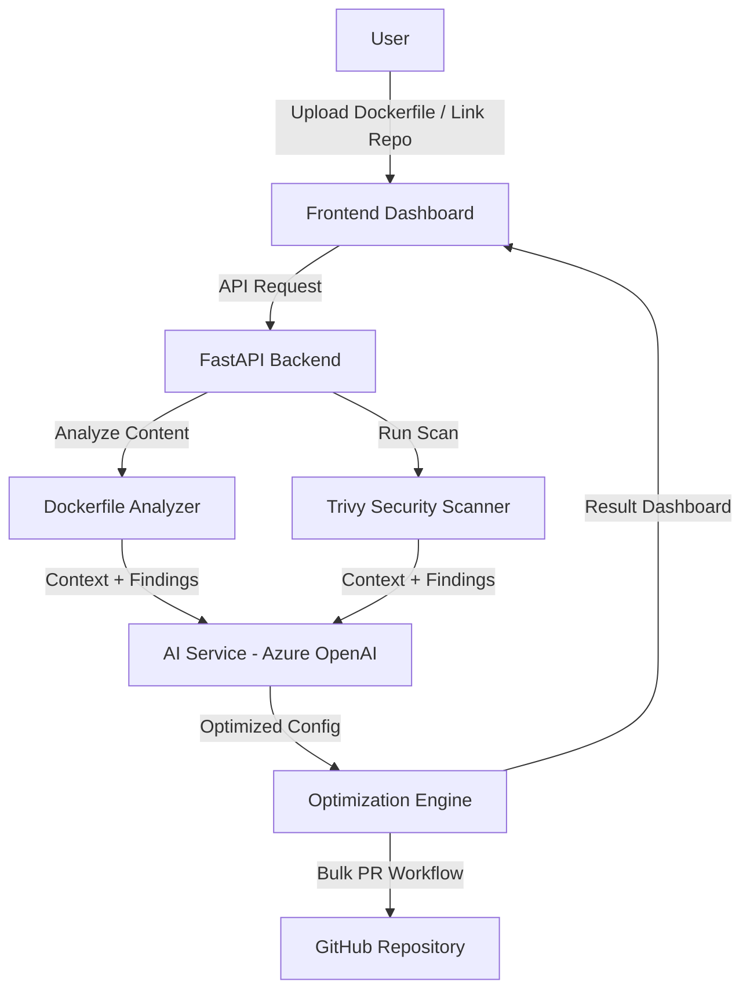

# AI-Powered Container Optimizer

## ABSTRACT
As containerization becomes the standard for modern application deployment, optimizing Docker images for size, performance, and security remains a complex and manual task. This project introduces an **AI-Powered Container Optimizer**, an intelligent system designed to automatically analyze, secure, and optimize container environments. Leveraging **Azure OpenAI's GPT-4o** and **Trivy security scanning**, the solution interprets Dockerfiles and running containers, identifies misconfigurations, detects vulnerabilities, and provides optimized, production-ready configurations—all through a modern, intuitive web interface.

The system employs a multi-stage pipeline: static Dockerfile analysis, runtime container inspection, vulnerability scanning using Trivy, and AI-driven optimization recommendations. Supporting deep integration with GitHub, the optimizer can automatically propose changes via Pull Requests, significantly reducing the manual effort required for container maintenance while ensuring secure and efficient deployments.

---

## TABLE OF CONTENTS
1. [Introduction](#introduction)
2. [Objective and Goals](#objective-and-goals)
3. [Project Overview](#project-overview)
4. [Problem Statement](#problem-statement)
5. [Proposed Solution](#proposed-solution)
6. [Workflow Diagram](#workflow-diagram)
7. [Technology Stack](#technology-stack)
8. [Implementation Details](#implementation-details)
9. [Results](#results)
10. [Conclusion](#conclusion)

---

## INTRODUCTION
The **AI-Powered Container Optimizer** addresses the growing complexity of managing containerized applications. While Docker provides the foundation for portability, ensuring that containers are minimal, secure, and follow best practices often requires specialized knowledge. Misconfigurations, bloated images, and unpatched vulnerabilities are common issues that can lead to performance bottlenecks and security risks.

This solution leverages advanced AI capabilities to bridge the gap between development and operations. By analyzing container definitions and runtime states, it provides actionable insights and automated fixes. The integration of security scanning and AI-driven rewriting of Dockerfiles ensures that the resulting infrastructure is both robust and efficient.

---

## OBJECTIVES AND GOALS

### Primary Objectives
*   **Automated Analysis**: Develop a system that can statically analyze Dockerfiles and dynamically inspect running containers for optimizations.
*   **AI-Driven Optimization**: Utilize LLMs to generate optimized Dockerfile versions that reduce image size and improve build performance.
*   **Security Integration**: Incorporate industry-standard security scanning to identify and mitigate vulnerabilities in container images.
*   **GitHub Integration**: Enable seamless collaboration by automating the delivery of optimizations via GitHub Pull Requests.

### Technical Goals
*   **Accuracy**: Achieve high precision in detecting common Docker misconfigurations (e.g., running as root, missing health checks).
*   **Performance**: Ensure real-time analysis capabilities for both local and remote container environments.
*   **Extensibility**: Build a modular architecture that supports multiple language runtimes and scan engines.
*   **User Experience**: Deliver a premium, responsive React-based dashboard for monitoring and managing container health.

---

## PROJECT OVERVIEW
This project implements a complete end-to-end pipeline for container lifecycle optimization:
1.  **Analysis**: Users can upload Dockerfiles, scan local containers, or provide GitHub repository URLs.
2.  **Detection**: The system identifies runtime environments (Python, Node.js, Go, etc.) and analyzes image layers.
3.  **Security Scanning**: Trivy scans images and configurations for vulnerabilities and secrets.
4.  **AI Optimization**: Azure OpenAI analyzes the findings and generates a "Refactored Dockerfile" following best practices.
5.  **Automated Remediation**: The system can create GitHub PRs with the optimized configurations directly.
6.  **Reporting**: Detailed dashboards provide insights into image size, layer breakdown, and security posture.

---

## PROBLEM STATEMENT

### Current Challenges
*   **Image Bloat**: Many production images contain unnecessary build tools and dependencies, increasing deployment times and costs.
*   **Security Vulnerabilities**: Manual tracking of vulnerabilities in base images and dependencies is error-prone and slow.
*   **Configuration Drift**: Dockerfiles often deviate from best practices over time, leading to inconsistent environments.
*   **Expertise Gap**: Writing highly optimized multi-stage Dockerfiles requires deep technical knowledge that many development teams lack.

### Impact
These challenges result in increased attack surfaces, slower CI/CD pipelines, higher cloud infrastructure costs, and potential deployment failures due to misconfigurations.

---

## PROPOSED SOLUTION

### Architecture Overview
The solution follows a modern microservices architecture:
**Frontend (React)** ↔ **Backend (FastAPI)** ↔ **AI Service (Azure OpenAI)** ↔ **Security (Trivy)** ↔ **GitHub API**

### Key Components
1.  **Frontend Interface**: A TypeScript-based React application using Tailwind CSS for a premium look, featuring drag-and-drop uploads and real-time scan progress.
2.  **Backend API**: A high-performance FastAPI service that orchestrates analysis, security scanning, and AI interactions.
3.  **AI Processing Engine**: Utilizes GPT-4o to interpret logs, error messages, and configurations to suggest optimal fixes.
4.  **Security Pipeline**: Integrates Trivy CLI for comprehensive vulnerability and misconfiguration scanning.
5.  **GitHub Service**: Handles repository cloning, file fetching, and the automated PR creation workflow.

---

## WORKFLOW DIAGRAM


---

## TECHNOLOGY STACK

### Frontend
*   **Framework**: React 18
*   **Language**: TypeScript
*   **Styling**: Tailwind CSS / Vanilla CSS
*   **Build Tool**: Vite

### Backend
*   **Framework**: FastAPI (Python 3.10+)
*   **Container Interaction**: Docker SDK for Python
*   **Security**: Trivy (Aqua Security)
*   **AI/ML**: Azure OpenAI API (GPT-4o)

### Infrastructure & Tools
*   **API Management**: REST API
*   **Version Control**: GitHub API Integration
*   **Logging**: Python Logging Module

---

## IMPLEMENTATION DETAILS

### Application Folder Structure
```text
container-optimizer/
├── backend/
│   ├── app/
│   │   ├── api/             # FastAPI Route Handlers
│   │   ├── core/            # Business Logic & Analyzers
│   │   │   ├── analyzers/   # Specialized scan logic
│   │   │   ├── ai_service.py
│   │   │   ├── github_service.py
│   │   │   └── security_scanner.py
│   │   ├── docker/          # Docker client wrappers
│   │   └── main.py          # Application Entrypoint
│   └── tests/               # Backend unit tests
├── frontend/
│   ├── src/
│   │   ├── components/      # UI Components (Upload, Results, Charts)
│   │   ├── hooks/           # Custom React hooks
│   │   ├── App.tsx          # Main Layout
│   │   └── api.ts           # API Client
│   └── vite.config.ts
└── README.md                # Project README
```

---

## RESULTS
The **AI-Powered Container Optimizer** provides:
*   **Reduced Image Size**: AI-driven multi-stage build recommendations often reduce image sizes by up to 60-80%.
*   **Enhanced Security**: Automatic detection and fixing of critical vulnerabilities before they reach production.
*   **Standardized Environments**: Ensures all containers follow organizational best practices and security policies.
*   **Developer Productivity**: Automates the tedious task of Dockerfile optimization, allowing teams to focus on core logic.

---

## CONCLUSION
The **AI-Powered Container Optimizer** successfully bridges the gap between raw container configs and production-ready deployments. By combining the analytical power of AI with industry-standard security tools, it provides a comprehensive solution for modern DevOps teams. The automated workflow from detection to Pull Request creation marks a significant step forward in autonomous infrastructure management.
